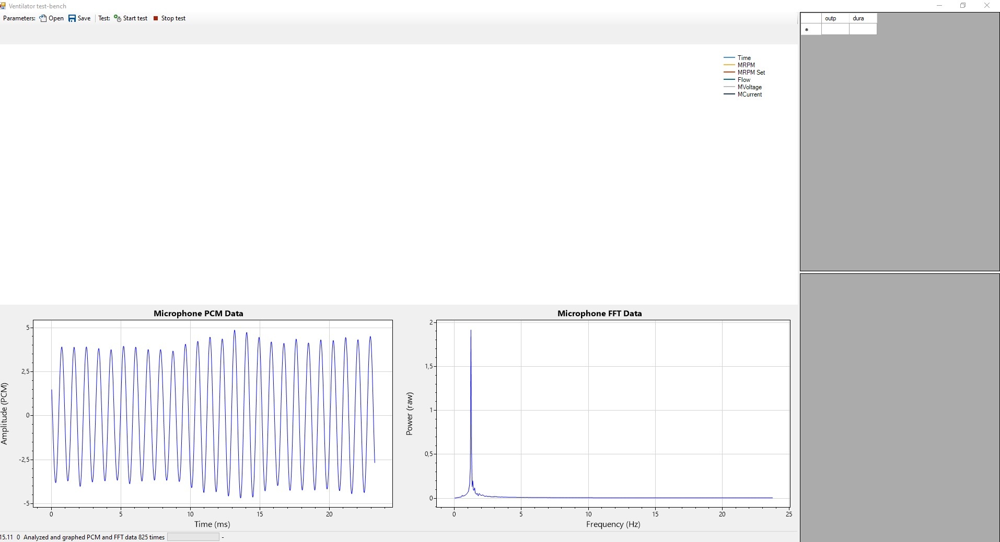
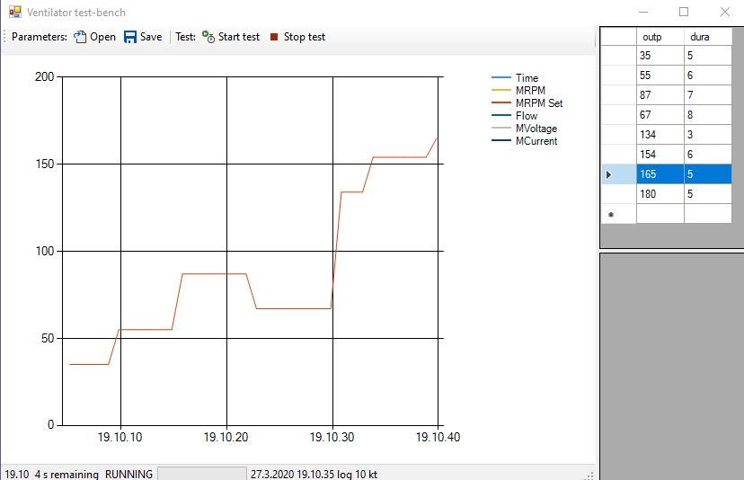

# openventilator-test-bench
Open ventilator project test-bench software (C#, Arduino)

You can join to our efforts in fighting Covid19 pandemia in here:

https://join.slack.com/t/open-ventilator/shared_invite/zt-cwh6py1x-C5tO4JewMUf2tRN7rwWB~g

<h3>Screenshot, audio FFT and PCM for analyzing pump noise</h3>

Some preliminary run-data

